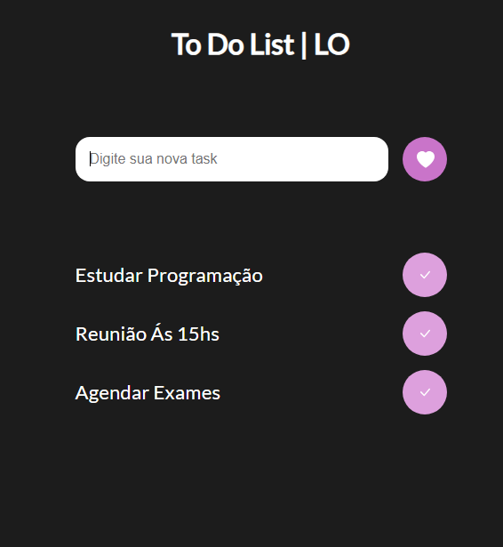

# to-do-list-javascript
To do List with HTML + CSS + JAVASCRIPT

Este é um projeto simples de lista de tarefas utilizando HTML, CSS e JavaScript para gerenciar tarefas armazenadas localmente no navegador.

## Funcionalidades

- Adicionar novas tarefas digitando na caixa de texto e clicando no botão com o ícone de coração.
- Remover tarefas concluídas clicando no botão de marcação de verificação ao lado de cada tarefa.
- Armazenamento local das tarefas usando localStorage do navegador para persistência de dados.

## Referência

Este projeto foi desenvolvido com base em um tutorial do YouTube fornecido por Gustavo Neitzke. O vídeo pode ser encontrado (https://www.youtube.com/watch?v=MxP4jZQY0h4&ab_channel=GustavoNeitzke).

## Pré-requisitos

- Navegador da web moderno que suporte JavaScript.

## Instalação

Não é necessário instalação. Basta clonar ou baixar o repositório e abrir o arquivo `index.html` em seu navegador.

